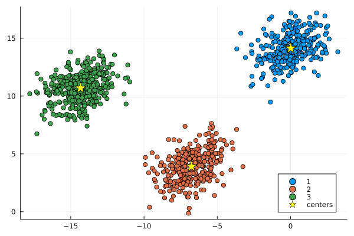
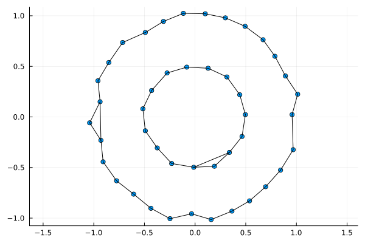

# Who am I ?


  * My name is *Pierre Navaro*
  * Scientific Computing Engineer at Insitut de Recherche Mathématique de Rennes
  * **Fortran 77 + PVM** : during my PhD 1998-2002 (Université du Havre)
  * **Fortran 90-2003 + OpenMP-MPI** : Engineer in Strasbourg (2003-2015) at IRMA
  * **Numpy + Cython, R + Rcpp** : Engineer in Rennes (2015-now) at IRMAR
  * **Julia v1.0** since July 2018


Slides : https://plmlab.math.cnrs.fr/navaro/JuliaParis2023


This is a joint work with [*Claire Brécheteau*](https://brecheteau.perso.math.cnrs.fr/page/index.html)  from Ecole Centrale de Nantes.


---


# The $k$-means method


$P$ distribution on $\mathbb{R}^d$


$$
\mathbf{c}= (c_1,c_2,\ldots,c_k) \in (\mathbb{R}^d)^k
$$


The optimal codebook $\mathbf{c}^*$ minimizes the $k$-means loss function 


$$
R : \mathbf{c}\mapsto P\min_{i = 1..k}\|\cdot-c_i\|^2.
$$


## Algorithm


  * Initialize k centroids.
  * Calculate the distance of every point to every centroid.
  * Assign every point to a cluster, by choosing the centroid with the minimum distance to the point.
  * Recalculate the centroids using the mean of the assigned points.
  * Repeat the steps until reaching convergence.


---


class: center, middle


# Lloyd’s algorithm method


---


class: center, middle


# Lloyd’s algorithm method


---


class: center, middle


# Lloyd’s algorithm method


---


class: center, middle


# Lloyd’s algorithm method


---


class: center, middle


# Lloyd’s algorithm method


---


# Compute the distance


```julia
function euclidean(a::AbstractVector{T}, b::AbstractVector{T}) where {T<:AbstractFloat}

    s = zero(T)
    for i in eachindex(a)
        s += (a[i] - b[i])^2
    end
    return sqrt(s)

end
```


```
euclidean (generic function with 1 method)
```


## Distances.jl


```julia
using Distances

euclidean = Euclidean()
```


---


## Initialize centers


```julia
using StatsBase

function initialize_centers(data, k)
    n = size(data, 1)
    return [data[i, :] for i in sample(1:n, k, replace=false)]
end
```


```
initialize_centers (generic function with 1 method)
```


## Estimate cluster to all observations


```julia
function update_labels!( labels, data, centers)

    for (i, obs) in enumerate(eachrow(data))
        dist = [euclidean(obs, c) for c in centers]
        labels[i] = argmin(dist)
    end

end
```


```
update_labels! (generic function with 1 method)
```


---


## Update centers using the mean


```julia
function update_centers!(centers, data, labels)

    for k in eachindex(centers)
        centers[k] = vec(mean(view(data, labels .== k, :), dims = 1))
    end

end
```


```
update_centers! (generic function with 1 method)
```


---


## Compute inertia


```julia
function compute_inertia(centers, labels, data)
   inertia = 0.0
   for k in eachindex(centers)
       cluster = view(data, labels .== k, :)
       inertia += sum(euclidean(p, centers[k])^2 for p in eachrow(cluster))
   end
   return inertia
end
```


```
compute_inertia (generic function with 1 method)
```


---


# $k$-means


```julia
function kmeans( data, k; maxiter = 100, nstart = 10)

    n, d = size(data)
    opt_centers = [zeros(d) for i in 1:k]  # allocate optimal centers
    labels = zeros(Int, n) # initialize labels
    opt_inertia = Inf
    for istart in 1:nstart
        centers = initialize_centers(data, k)
        for istep in 1:maxiter
            old_centers = deepcopy(centers)
            update_labels!( labels, data, centers)
            update_centers!(centers, data, labels)
            centers ≈ old_centers && break
        end
        inertia = compute_inertia(centers, labels, data)
        if inertia < opt_inertia
            opt_inertia = inertia
            opt_centers .= deepcopy(centers)
        end
    end
    update_labels!( labels, data, opt_centers)
    return opt_centers, labels

end
```


```
kmeans (generic function with 1 method)
```


---


```julia
using Plots, CluGen

o = clugen(2, 3, 1000, [1, 1], pi / 8, [10, 10], 10, 2, 1)
centers, labels = kmeans(o.points, 3)
scatter( o.points[:,1], o.points[:,2], group=labels)
scatter!( Tuple.(centers), m = :star, ms = 10, c = :yellow, label = "centers")
```





---


class: center, middle


# Approximation of a compact set


---


class: center, middle


# Approximation of a compact set


---


class: center, middle


# Approximation of a compact set


---


class: middle


# Noisy circle


```julia
using Random

rng = MersenneTwister(72)

function noisy_circle(rng, n, noise=0.05)
    x = zeros(n)
    y = zeros(n)
    for i in 1:n
        θ = 2π * rand(rng)
        x[i] = cos(θ) + 2 * noise * (rand(rng) - 0.5)
        y[i] = sin(θ) + 2 * noise * (rand(rng) - 0.5)
    end
    return vcat(x', y')
end
```


```
noisy_circle (generic function with 2 methods)
```


---


```julia
nc = noisy_circle(rng, 1000)
points = hcat(nc, 0.5 .* nc )
scatter(points[1,:], points[2,:]; aspect_ratio=1, legend=false, title="noisy circles")
```


---


```julia
import LinearAlgebra: norm

function find_centers( points, ϵ )
    centers = Dict{Int, Int}() # dict of points
    centers_counter = 1

    for (idx_p, p) in enumerate(eachcol(points)) # Loop over points

        is_covered = false

        for idx_v in keys(centers) # Loop over centers
            distance = norm(p .- points[:, centers[idx_v]])
            if distance <= ϵ
                is_covered = true
                break
            end
        end

        if !is_covered
            centers[centers_counter] = idx_p
            centers_counter += 1
        end

    end
    return centers
end

ϵ = 0.2
centers = find_centers( points, ϵ )
```


```
Dict{Int64, Int64} with 37 entries:
  5  => 5
  16 => 25
  20 => 50
  35 => 1029
  12 => 15
  24 => 108
  28 => 1003
  8  => 10
  17 => 28
  30 => 1007
  1  => 1
  19 => 38
  22 => 70
  23 => 75
  6  => 6
  32 => 1013
  11 => 14
  36 => 1249
  37 => 1347
  ⋮  => ⋮
```


---


```julia
idxs = collect(values(centers))
p = scatter(points[1,idxs], points[2,idxs]; aspect_ratio=1, label="centers")
function ball(h, k, r)
    θ = LinRange(0, 2π, 500)
    h .+ r * sin.(θ), k .+ r * cos.(θ)
end
for i in idxs
    plot!(p, ball(points[1,i], points[2,i], ϵ), seriestype = [:shape,], lw = 0.5, c = :blue,
            linecolor = :black, legend = false, fillalpha = 0.1, aspect_ratio = 1)
end
scatter!(p, points[1,:], points[2,:]; aspect_ratio=1, ms = 2)
```


---


```julia
function compute_points_covered_by_landmarks( points, centers :: Dict{Int, Int}, ϵ)
    points_covered_by_landmarks = Dict{Int,Vector{Int}}()
    for idx_v in values(centers)
        points_covered_by_landmarks[idx_v] = Int[]
        for (idx_p, p) in enumerate(eachcol(points))
            distance = norm(p .- points[:,idx_v])
            if distance <= ϵ
                push!(points_covered_by_landmarks[idx_v], idx_p)
            end
        end
    end
    return sort(points_covered_by_landmarks)
end
points_covered_by_landmarks = compute_points_covered_by_landmarks( points, centers, ϵ)
```


```
OrderedCollections.OrderedDict{Int64, Vector{Int64}} with 37 entries:
  1  => [1, 33, 42, 47, 48, 78, 112, 115, 117, 136  …  749, 778, 792, 841, 869,…
  2  => [2, 22, 32, 49, 59, 61, 68, 76, 102, 113  …  760, 763, 803, 817, 824, 8…
  3  => [3, 8, 36, 37, 100, 139, 164, 169, 175, 181  …  853, 870, 899, 909, 918…
  4  => [4, 9, 22, 32, 61, 76, 93, 102, 110, 130  …  791, 803, 822, 833, 846, 8…
  5  => [5, 33, 51, 63, 73, 82, 112, 115, 121, 136  …  838, 855, 869, 908, 912,…
  6  => [6, 11, 58, 77, 81, 89, 137, 167, 187, 198  …  871, 872, 898, 933, 945,…
  7  => [7, 60, 94, 104, 106, 123, 143, 184, 188, 221  …  890, 905, 906, 916, 9…
  10 => [10, 97, 183, 198, 200, 209, 222, 232, 256, 263  …  942, 945, 947, 948,…
  12 => [12, 40, 52, 56, 64, 80, 87, 146, 193, 212  …  807, 830, 832, 845, 903,…
  13 => [13, 18, 19, 27, 44, 66, 84, 90, 103, 114  …  839, 840, 867, 873, 881, …
  14 => [14, 21, 29, 57, 72, 95, 124, 137, 171, 180  …  852, 859, 872, 888, 898…
  15 => [15, 17, 24, 30, 88, 91, 106, 152, 161, 170  …  810, 826, 835, 851, 876…
  16 => [16, 26, 31, 41, 43, 46, 54, 55, 62, 67  …  856, 866, 868, 882, 883, 90…
  20 => [20, 52, 64, 69, 71, 87, 111, 179, 193, 212  …  801, 815, 830, 842, 845…
  23 => [23, 42, 78, 79, 120, 142, 145, 153, 190, 192  …  721, 724, 812, 841, 8…
  25 => [25, 34, 45, 85, 86, 97, 98, 128, 132, 134  …  921, 923, 929, 931, 932,…
  28 => [18, 19, 26, 28, 43, 54, 67, 92, 109, 118  …  866, 873, 883, 910, 937, …
  35 => [35, 39, 49, 59, 65, 68, 99, 113, 116, 149  …  793, 806, 817, 824, 854,…
  38 => [38, 74, 101, 105, 122, 135, 141, 155, 157, 194  …  850, 857, 864, 875,…
  ⋮  => ⋮
```


---


```julia
using RecipesBase

@userplot GraphPlot

@recipe function f(gp::GraphPlot)

    points, points_covered_by_landmarks = gp.args

    aspect_ratio := 1
    idxs = collect(keys(points_covered_by_landmarks)) # centers

    @series begin
        seriestype := :scatter
        points[1,idxs], points[2,idxs]
    end

    for (i, idx_v) in enumerate(idxs[1:end-1]), idx_u in idxs[i+1:end]
        if !isdisjoint(points_covered_by_landmarks[idx_v], points_covered_by_landmarks[idx_u])
            x1, y1 = points[:,idx_v]
            x2, y2 = points[:,idx_u]
            @series begin
                color := :black
                legend := false
                [x1, x2], [y1, y2]
            end
        end
    end

end
```


---


```julia
graphplot(points, points_covered_by_landmarks)
```





---


.cols[ .fifty[


```julia
n = length(f)
v = sortperm(f, rev = true) # sort vertices using f
sort!(f, rev = true) # sort f
v_inv = Dict(zip(v, 1:n)) 
G = [[v_inv[i] for i in subset] for subset in graph[v]]
𝒰 = IntDisjointSets(n)
for i = eachindex(v)
    𝒩 = [j for j in G[i] if j < i]
    if length(𝒩) != 0
        g = 𝒩[argmax(view(f, 𝒩))] 
        e_i = find_root!(𝒰, g) 
        e_i = union!(𝒰, e_i, i) 
        for j in 𝒩 
            e_j = find_root!(𝒰, j) 
            if e_i != e_j && min(f[e_i], f[e_j]) <= f[i] + τ 
                if f[e_j] <= f[e_i]
                    e_i = union!(𝒰, e_i, e_j)
                else
                    e_i = union!(𝒰, e_j, e_i)
                end
            end
        end
    end
end
```


]


.fifty[


] ]


---


class: center, middle


# Clustering with unions of ellipsoids


---


class: center, middle


# Packages in progress


https://github.com/pnavaro/GeometricClusterAnalysis.jl


https://github.com/pnavaro/ClusteringToMATo.jl

