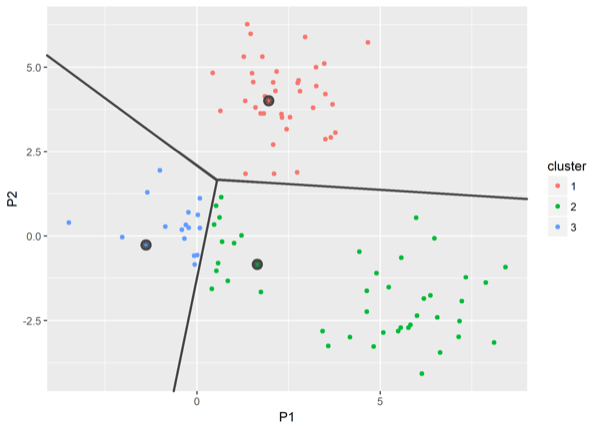
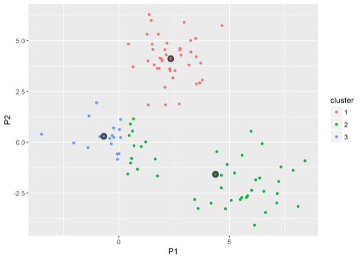
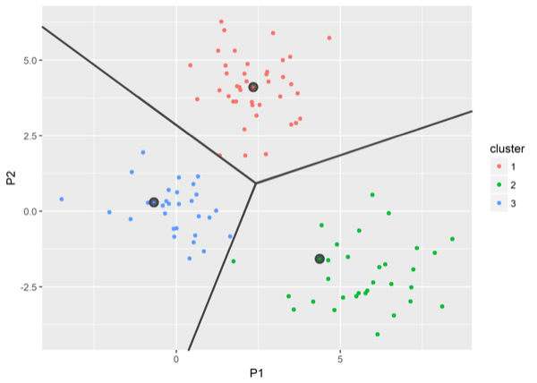
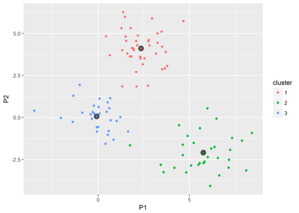
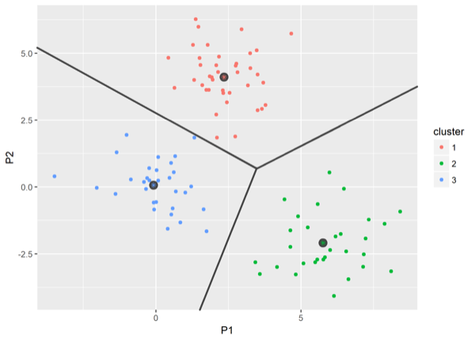
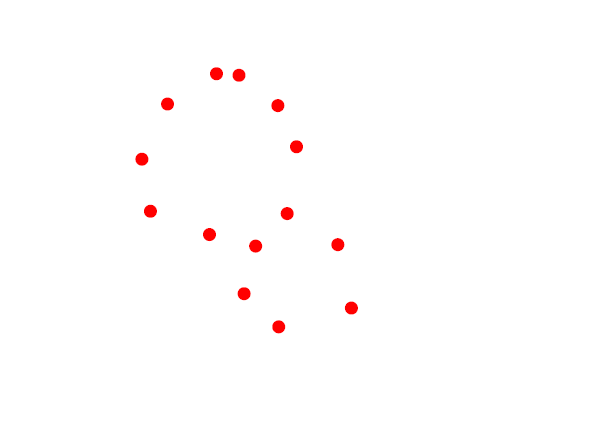
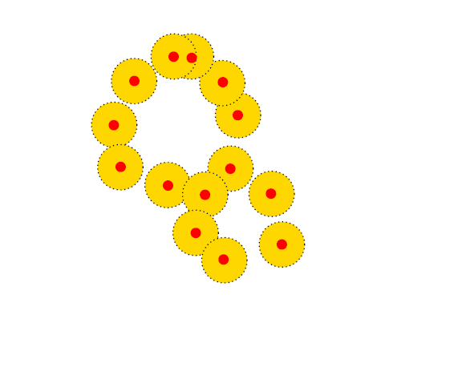
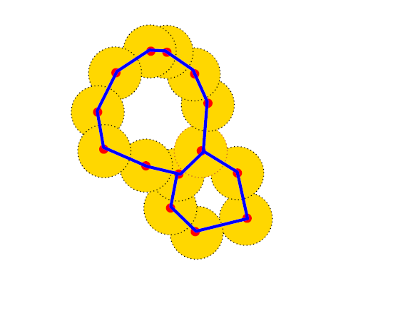

# Who am I ?

 - My name is *Pierre Navaro*

 - Scientific Computing Engineer at Insitut de Recherche Mathématique de Rennes

 - **Fortran 77 + PVM** : during my PhD 1998-2002 (Université du Havre)

 - **Fortran 90-2003 + OpenMP-MPI** : Engineer in Strasbourg (2003-2015) at IRMA

 - **Numpy + Cython, R + Rcpp** : Engineer in Rennes (2015-now) at IRMAR

 - **Julia v1.0** since July 2018

 Slides : https://plmlab.math.cnrs.fr/navaro/JuliaParis2023

 This is a joint work with [*Claire Brécheteau*](https://brecheteau.perso.math.cnrs.fr/page/index.html)
 from Ecole Centrale de Nantes.

---

# The $k$-means method

``P`` distribution on ``\mathbb{R}^d``

```math
\mathbf{c}= (c_1,c_2,\ldots,c_k) \in (\mathbb{R}^d)^k
```

The optimal codebook $\mathbf{c}^*$ minimizes the $k$-means loss function 

```math
R : \mathbf{c}\mapsto P\min_{i = 1..k}\|\cdot-c_i\|^2.
```

## Algorithm

- Initialize k centroids.
- Calculate the distance of every point to every centroid.
- Assign every point to a cluster, by choosing the centroid with the minimum distance to the point.
- Recalculate the centroids using the mean of the assigned points.
- Repeat the steps until reaching convergence. 

---

# Lloyd’s algorithm method 



---

# Lloyd’s algorithm method 



---

# Lloyd’s algorithm method 



---

# Lloyd’s algorithm method 



---

# Lloyd’s algorithm method
 
 
 

---

# Compute the distance

```@example paris
function euclidean(a::AbstractVector{T}, b::AbstractVector{T}) where {T<:AbstractFloat}

    s = zero(T)
    for i in eachindex(a)
        s += (a[i] - b[i])^2
    end
    return sqrt(s)

end
```

## Distances.jl

```julia
using Distances

euclidean = Euclidean()
```

---

## Initialize centers

```@example paris
using StatsBase

function initialize_centers(data, k) 
    n = size(data, 1)
    return [data[i, :] for i in sample(1:n, k, replace=false)]
end
```

## Estimate cluster to all observations

```@example paris
function update_labels!( labels, data, centers)

    for (i, obs) in enumerate(eachrow(data))
        dist = [euclidean(obs, c) for c in centers]
        labels[i] = argmin(dist)
    end

end
```

---

## Update centers using the mean


```@example paris
function update_centers!(centers, data, labels)
    
    for k in eachindex(centers)
        centers[k] = vec(mean(view(data, labels .== k, :), dims = 1))
    end

end
```

---

##  Compute inertia

```@example paris
function compute_inertia(centers, labels, data)
   inertia = 0.0
   for k in eachindex(centers)
       cluster = view(data, labels .== k, :)
       inertia += sum(euclidean(p, centers[k])^2 for p in eachrow(cluster))
   end
   return inertia
end
```

---

# $k$-means

```@example paris
function kmeans( data, k; maxiter = 100, nstart = 10)

    n, d = size(data)
    opt_centers = [zeros(d) for i in 1:k]  # allocate optimal centers
    labels = zeros(Int, n) # initialize labels
    opt_inertia = Inf
    for istart in 1:nstart
        centers = initialize_centers(data, k)
        for istep in 1:maxiter
            old_centers = deepcopy(centers)
            update_labels!( labels, data, centers)
            update_centers!(centers, data, labels)
            centers ≈ old_centers && break
        end
        inertia = compute_inertia(centers, labels, data)
        if inertia < opt_inertia
            opt_inertia = inertia
            opt_centers .= deepcopy(centers)
        end
    end
    update_labels!( labels, data, opt_centers)
    return opt_centers, labels

end
```

---

```@example paris
using Plots, CluGen

o = clugen(2, 3, 1000, [1, 1], pi / 8, [10, 10], 10, 2, 1)
centers, labels = kmeans(o.points, 3)
scatter( o.points[:,1], o.points[:,2], group=labels)
scatter!( Tuple.(centers), m = :star, ms = 10, c = :yellow, label = "centers")
savefig("plot1.svg") # hide
nothing # hide
```


---

# Approximation of a compact set



---

# Approximation of a compact set



---

# Approximation of a compact set



---

# Noisy circle

```@example paris
using Random

rng = MersenneTwister(1234)

function noisy_circle(rng, n, noise=0.05)
    x = zeros(n)
    y = zeros(n)
    for i in 1:n
        θ = 2π * rand(rng)
        x[i] = cos(θ) + 2 * noise * (rand(rng) - 0.5)
        y[i] = sin(θ) + 2 * noise * (rand(rng) - 0.5)
    end
    return vcat(x', y')
end
```

---

```@example paris
nc = noisy_circle(rng, 1000)
points = hcat(nc, 0.5 .* nc )
scatter(points[1,:], points[2,:]; aspect_ratio=1, legend=false, title="noisy circles")
savefig("plot2.svg") # hide
nothing # hide
```


---

```@example paris
import LinearAlgebra: norm

function find_centers( points, ϵ )
    centers = Dict{Int, Int}() # dict of points
    centers_counter = 1
    
    for (idx_p, p) in enumerate(eachcol(points)) # Loop over points
        
        is_covered = false

        for idx_v in keys(centers) # Loop over centers
            distance = norm(p .- points[:, centers[idx_v]])
            if distance <= ϵ
                is_covered = true
                break
            end
        end

        if !is_covered
            centers[centers_counter] = idx_p
            centers_counter += 1
        end
        
    end
    return centers
end

ϵ = 0.2
centers = find_centers( points, ϵ )

```

---


```@example paris
idxs = collect(values(centers))
p = scatter(points[1,idxs], points[2,idxs]; aspect_ratio=1, label="centers")
function ball(h, k, r)
    θ = LinRange(0, 2π, 500)
    h .+ r * sin.(θ), k .+ r * cos.(θ)
end
for i in idxs
    plot!(p, ball(points[1,i], points[2,i], ϵ), seriestype = [:shape,], lw = 0.5, c = :blue, 
            linecolor = :black, legend = false, fillalpha = 0.1, aspect_ratio = 1)
end
scatter!(p, points[1,:], points[2,:]; aspect_ratio=1, ms = 2)
savefig("plot3.svg") # hide
nothing # hide
```


---

```@example paris
function compute_points_covered_by_landmarks( points, centers :: Dict{Int, Int}, ϵ)
    points_covered_by_landmarks = Dict{Int,Vector{Int}}()
    for idx_v in values(centers)
        points_covered_by_landmarks[idx_v] = Int[]
        for (idx_p, p) in enumerate(eachcol(points))
            distance = norm(p .- points[:,idx_v])
            if distance <= ϵ
                push!(points_covered_by_landmarks[idx_v], idx_p)
            end
        end
    end
    return sort(points_covered_by_landmarks)
end
points_covered_by_landmarks = compute_points_covered_by_landmarks( points, centers, ϵ)
```

----

```@example paris
using RecipesBase

@userplot GraphPlot

@recipe function f(gp::GraphPlot)

    points, points_covered_by_landmarks = gp.args
    
    aspect_ratio := 1
    idxs = collect(keys(points_covered_by_landmarks)) # centers
    
    @series begin
        seriestype := :scatter
        points[1,idxs], points[2,idxs]
    end

    for (i, idx_v) in enumerate(idxs[1:end-1]), idx_u in idxs[i+1:end]
        if !isdisjoint(points_covered_by_landmarks[idx_v], points_covered_by_landmarks[idx_u])
            x1, y1 = points[:,idx_v]
            x2, y2 = points[:,idx_u]
            @series begin
                color := :black
                legend := false
                [x1, x2], [y1, y2]
            end
        end
    end

end
```

----

```@example paris
graphplot(points, points_covered_by_landmarks)
savefig("plot4.svg") # hide
nothing # hide
```


---

class: center, middle

# Clustering with unions of ellipsoids 


---

class: center, middle

# Package

https://github.com/pnavaro/GeometricClusterAnalysis.jl

---

Test two columns

.cols[
.fifty[
left

- a
- b
- c
]

.fifty[
right

- a
- b
- c
]
]
